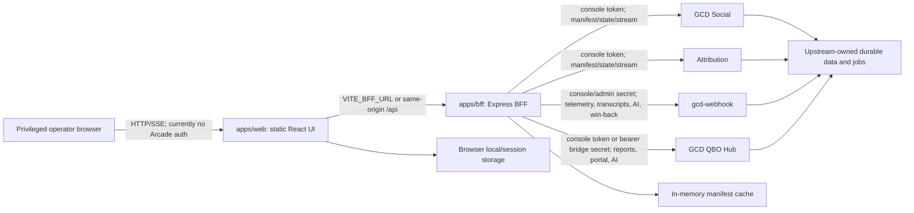

# GCD Arcade

GCD Arcade is German Car Depot's internal operations launcher and read-oriented
aggregation UI. A React/Vite static site calls a Node/Express backend-for-
frontend (BFF), which discovers four independently deployed systems and renders
their console snapshots, event streams, reports, transcripts, and assistant
views. Arcade does not own the upstream systems' business data or schedules.

**Status (2026-08-10):** the active application is the root npm-workspaces
monorepo. It builds successfully from source. `render.yaml` describes a Render
static site and BFF service, but this audit did not inspect the Render account or
live endpoints; deployment and environment state remain externally unverified.
The BFF currently has no caller authentication and must be treated as sensitive.

## If you have to take over today

1. Read [status](docs/STATUS.md), [security and continuity](docs/SECURITY_AND_CONTINUITY.md), and [operations](docs/OPERATIONS.md).
2. Confirm the intended Render services, owners, and access restrictions in the
   private continuity register; do not infer them from `render.yaml`.
3. Check `GET /api/health`, then `GET /api/apps`; an `online: false` tile means
   manifest discovery failed, not necessarily that the upstream product is down.
4. Treat the Arcade URL and every BFF route as privileged until BFF
   authentication and authorization are implemented.
5. Before a change, run `git status --short --branch` and preserve user work.
6. Use `.env.example` with outbound integrations disabled for local work. Never
   paste production tokens, transcript content, customer records, or QBO data
   into issues, docs, fixtures, or commits.
7. Validate with `npm ci`, `npm run build`, `npm audit`, Markdown-link and
   environment-coverage checks; record anything that cannot run.

## Repository map

| Path | Classification | Responsibility |
|---|---|---|
| `apps/web/` | active | React 18/Vite launcher and specialized operational views |
| `apps/bff/` | active | Express API, manifest aggregation, credentialed upstream proxies, SSE relay |
| `packages/shared/` | active | permissive `/console/*` and tile TypeScript types |
| `render.yaml` | active, externally unverified | intended Render service blueprint |
| `integrations/` | reference only | copy/adaptation examples for other repositories; not executed by this monorepo |
| `docs/` | current | authoritative architecture, operations, integration, data, environment, security, and status runbooks |
| `docs/archive/` | historical only | completed handoffs and superseded plans; never operating instructions |

There is no second application tree, database schema, migration directory, CI
workflow, test suite, Dockerfile, or scheduler in this repository.

## Architecture and data flow



The BFF fetches each enabled upstream `/console/manifest` concurrently, caches
the result in one process for `MANIFEST_TTL_MS`, and converts manifests into an
ordered tile list. The browser polls snapshots in selected views and opens SSE
streams through the BFF. Specialized views also call allow-listed bridges for
transcripts, win-back data, QBO reports, cash-sheet data, coworker questions,
and assistant conversations. See [architecture](docs/ARCHITECTURE.md) and
[integrations](docs/INTEGRATIONS.md).

## Running components and surfaces

- Web entry: `apps/web/src/main.tsx`; Vite development port `5173`.
- BFF entry: `apps/bff/src/server.ts`; default port `8787`.
- Shared contract: `packages/shared/src/index.ts`.
- Health: `GET /api/health` is liveness only; it does not check upstreams.
- Discovery/telemetry: `GET /api/apps`, `/state`, and `/stream`.
- Specialized reads: transcript, win-back, reporting, cash-sheet-sync,
  coworker-portal, and assistant GET routes.
- Mutating/cost-bearing calls: reporting refresh POST, QBO assistant POST, and
  transcript AI-chat POST. These are not protected by Arcade-side auth.

The full route and trust-boundary inventory is in
[docs/ARCHITECTURE.md](docs/ARCHITECTURE.md).

## Local development

Requirements: Node.js 20 or newer and npm. Render requests Node 22.

```bash
npm ci
cp .env.example .env.local
set -a
source .env.local
set +a
npm run dev
```

`npm run dev` builds the shared package, starts the BFF on `:8787`, and starts
Vite on `:5173`. Vite proxies `/api` to `BFF_PROXY_TARGET` (default
`http://localhost:8787`). The BFF does not automatically load env files, so the
commands above export the ignored `.env.local` into the current shell. Keep all
upstreams disabled until intentionally testing them.

Production build:

```bash
npm run build
```

There are currently no repository-defined tests or lint command. See
[CONTRIBUTING.md](CONTRIBUTING.md) for the complete definition of done.

## Deploy, recover, and roll back

`render.yaml` intends two Render services: `gcd-arcade-bff` and
`gcd-arcade-web`. It does not prove they exist, are private, use these exact
URLs, or have the required secrets. Confirm dashboard state before deploying.
This repository has no durable server-side data to back up; recovery means
restoring configuration and redeploying a known-good commit. Browser-local
preferences/counters are disposable. Upstream data backup and recovery belong
to each source repository. Follow [docs/OPERATIONS.md](docs/OPERATIONS.md).

## Known risks and immediate follow-ups

- Add BFF authentication, authorization, and an explicit browser-origin allowlist.
- Restrict or remove unauthenticated cost/state-affecting POST routes.
- Replace query-string admin-secret link-outs; the redirect destination exposes
  the secret to browser history and potentially logs/referrers.
- Verify Render privacy, service URLs, environment values, owners, monitoring,
  and rollback access outside Git.
- Add automated tests and CI, plus dependency and secret scanning.
- Reconcile `integrations/` examples against each current upstream repository;
  copied snapshots here are not authoritative for those systems.

The dated risk register is [docs/STATUS.md](docs/STATUS.md).

## Documentation source of truth

Executable source, tests, migrations, and checked-in configuration define actual
behavior. This README is the zero-context index. Current focused runbooks live
under `docs/`; upstream code defines upstream behavior; `docs/archive/` is
historical only. `AGENTS.md` makes continuous documentation part of acceptance.

**Documentation is part of every change.** Update affected docs, examples,
commands, paths, diagrams, external setup instructions, and unresolved-risk
records in the same atomic change as behavior. A later documentation pass is not
an acceptable substitute except for a recorded emergency follow-up.

## Runbook index

- [Architecture](docs/ARCHITECTURE.md)
- [Operations](docs/OPERATIONS.md)
- [Integrations](docs/INTEGRATIONS.md)
- [Data model](docs/DATA_MODEL.md)
- [Environment](docs/ENVIRONMENT.md)
- [Security and continuity](docs/SECURITY_AND_CONTINUITY.md)
- [Current status](docs/STATUS.md)
- [Contributing](CONTRIBUTING.md)
- [Historical archive](docs/archive/README.md)
